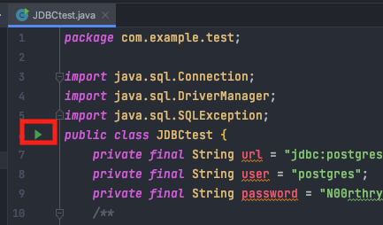
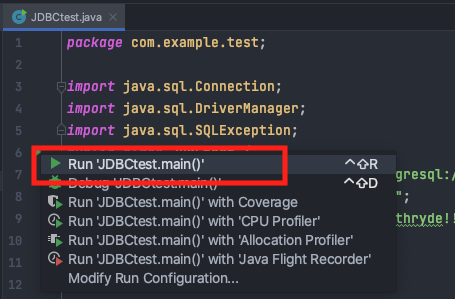
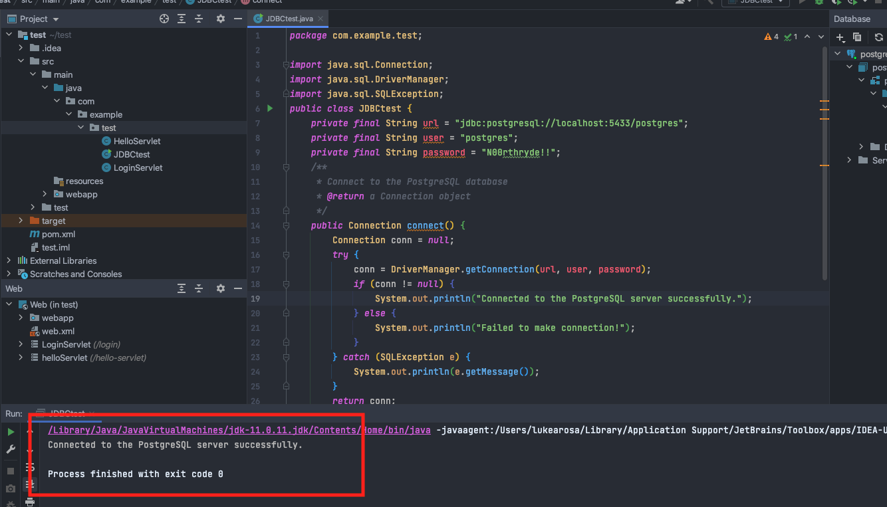

## Create Your First Web Application

This tutorial has been made for students unfamiliar with creating web applications. It will familiarise you with
IntelliJ, Java Servlet Pages (JSPs), Maven, and PostgreSQL.

For some people, this may be the first time you have encountered the tools we will be using in the project.
Below is a list of extra resources you can use to become more familiar with them.

| Tool | Use | Resources |
| --- | --- | --- |
| GitHub | Version control | 1. An interactive and visual tool to learn git commands: [view](https://learngitbranching.js.org)</br>2. GitHub Learning Lab: [view](https://lab.github.com/githubtraining/introduction-to-github)|
| Maven | Build automation tool | Learn how to use Maven in 5-minutes: [view](https://maven.apache.org/guides/getting-started/maven-in-five-minutes.html)|
| Heroku | Platform as a Service (PaaS) | Developer Centre: [view](https://devcenter.heroku.com/categories/reference)|
| PostgreSQL | Database | 1. PostgreSQL tutorial: [view](https://www.postgresqltutorial.com)</br>2. PostgreSQL tutorials and exercises: [view](https://www.postgresql.org/docs/online-resources/)|
| Java Database Connectivity (JDBC) | An application programming interface (API) for the programming language Java, which defines how a client may access a database. | |
| Java Servlet Pages (JSPs) | Server-side programming technology that enables the creation of dynamic, platform-independent method for building Web applications. | |
| TomCat | | |

<details>
<summary>Create a Web Application in IntelliJ</summary>
Please complete the below steps to create your first project:

[Step 1: Install IntelliJ Professional Edition](../../tutorials/1_intellij_install.md)

[Step 2: Download Tomcat](../../tutorials/2_tomcat_download.md)

[Step 3: Setup PostgreSQL](../../tutorials/3_postgresql_setup.md)

[Step 4: Create Project in IntelliJ](../../tutorials/4_create_project.md)

</details>
<details>
<summary>Create a Servlet</summary>

In this example, the project is titled 'test'. Expand the directory as shown below and create a servlet:


We are going to create a LoginServlet:


Title the servlet LoginServlet and change the value to be '/login' - the value becomes 
the URL of the servlet. For example, I can access the servlet by running the TomCat configuration and navigating to:
````
'localhost.com:8080/login'
````


In the doGet method, add the following code:
````
protected void doGet(HttpServletRequest request, HttpServletResponse response) throws
ServletException, IOException {
    response.setContentType("text/html");
    System.out.println("Hello from Get method");
    PrintWriter writer = response.getWriter();
    writer.println("<h3> Hello in HTML</h3>");
}
````


Run the TomCat configuration:


If a browser does not launch, open one and navigate to localhost:8080/<project_name>_war_exploded/login:


You will see the doGet() method you just edited:


You just created your first servlet! :boom:
</details>
<details>
<summary>Create a JSP</summary>

Right click in the webapp directory to create a new JSP:


Enter a name for the JSP:


You have created your first JSP:


However, without a servlet to serve the JSP, it will not be accessible.

In the login JSP you just created, write something (it does not matter what). Something in the body, so it is 
visible when you navigate to the page:


Open the LoginServlet again and remove the code in the doGet() method and add the following:
````
response.sendRedirect("login.jsp");
````


Run the TomCat configuration:


A browser window should automatically open. Navigate to:
````
localhost:8080/<project_name>_war_exploded/login
````


The Login Servlet is now redirecting you to the login JSP you just created:


</details>
<details>
<summary>Passing parameters to a Servlet</summary>

There are two ways to pass parameters (arguments) to a servlet:
<details>
<summary>Using doGet() servlet method</summary>

Parameters are passed to the doGet() method as URL arguments:
````
?[parameterName1]=[parameterValue1]&[parameterName2]=[parameterValue2]
````

In the LoginServlet, remove the doGet() method body and add:
````
response.setContentType("text/html");
System.out.println("Hello from GET method in LoginServlet");
String user = request.getParameter("userName");
String pass = request.getParameter("passWord");
PrintWriter writer = response.getWriter();
writer.println("<h3> Hello from Get "+user+ " " +pass+ "</h3>");
````


As an example, navigate to:
````
http://localhost:8080/<project_name>_war_exploded/login?userName=luke&passWord=test
````


The servlet will print the values you passed as parameters:


</details>
<details>
<summary>Using doPost() servlet method</summary>

Open index.jsp, remove the text in the body and add:
````
<form action = "login" method = "post">
    User name: <input type = "text" name = "userName"><br/>
    Password: <input type = "password" name = "passWord"><br/>
    <input type = "submit" value = "Login">
</form>
````


Open the LoginServlet and add the below into the doPost() method:
````
response.setContentType("text/html");
System.out.println("Hello from Post method in LoginServlet");
String user = request.getParameter("userName");
String pass = request.getParameter("passWord");
PrintWriter writer = response.getWriter();
writer.println("<h3> Hello from Post: Your user name is: "+user+", Your password is: " +pass+
        "</h3>");
````


Run the TomCat configuration:


It should load the index.jsp by default:


Enter a username and password and select Login:


The index.jsp will post your username and password to the doGet() method of the LoginServlet, which, in turn, will print
them to HTML:


</details>
</details>

<details>
<summary>Connect to local PostgreSQL</summary>

You should have already connected to a local PostgreSQL instance.  
To open the database view:


Open a query console:


Run the follow SQL query to create a new table for users:
````
CREATE TABLE users (
    username    text,
    password text
````

It should return successfully, and you should now be able to see the new table in the database view:


Create a new Java file in (title it whatever you like):


Copy this to the newly created file but make sure to change the database URL, user, and password to match your own:
````
package com.example.test;

import java.sql.Connection;
import java.sql.DriverManager;
import java.sql.SQLException;
public class JDBCtest {
    private final String url = <insert URL>;
    private final String user = <insert user>;
    private final String password = <insert password>;
    /**
     * Connect to the PostgreSQL database
     * @return a Connection object
     */
    public Connection connect() {
        Connection conn = null;
        try {
            conn = DriverManager.getConnection(url, user, password);
            if (conn != null) {
                System.out.println("Connected to the PostgreSQL server successfully.");
            } else {
                System.out.println("Failed to make connection!");
            }
        } catch (SQLException e) {
            System.out.println(e.getMessage());
        }
        return conn;
    }
    public static void main(String[] args) {
        JDBCtest app = new JDBCtest();
        app.connect();
    }
}
````


> Make sure you launch pgAdmin and have the database instance running on your computer otherwise all queries will fail.

Seelct Run:





It will take a few seconds to run but then should return a successful query:



You have now created a table in your local PostgreSQL instance and have created a connection to it.
You can now build on queries on top of this.
</details>

<details>
<summary>Connect to Heroku PostgreSQL</summary>

You must have completed [Step 8: Deploy Project to Heroku](../../tutorials/8_heroku_deploy.md) before attempting this.

Now that you've deployed to Heroku, you must change the database credentials in order to access Heroku's PostgreSQL 
instance.

Change the JDBCtest class to be:
````
try {
    DriverManager.registerDriver(new org.postgresql.Driver());
    String DB_CONNECTION = System.getenv().get("JDBC_DATABASE_URL");
    Connection dbConnection = DriverManager.getConnection(DB_CONNECTION);
    return dbConnection;
    } catch (SQLException e) {
        <write error message here>
    }
}
````

For more help, go to Heroku's Developer Centre: [view](https://devcenter.heroku.com/articles/connecting-to-relational-databases-on-heroku-with-java).

</details>
