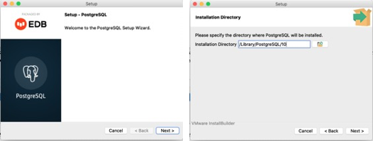
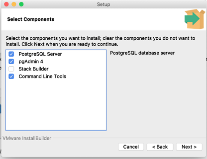
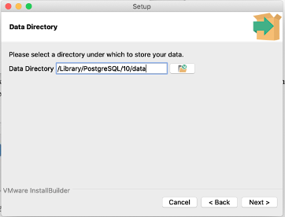
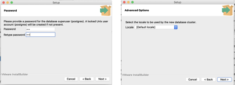
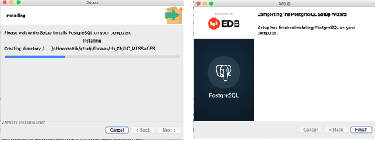
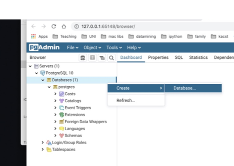
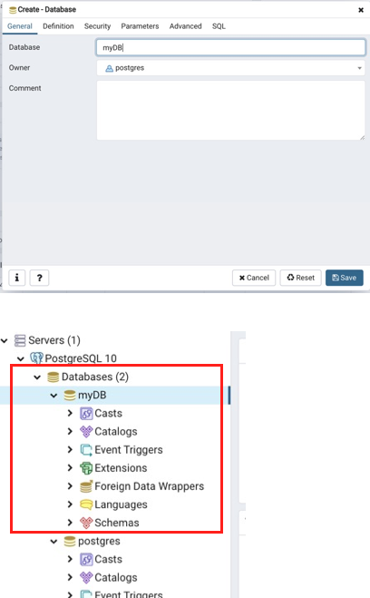

## Step 3: Setup PostgreSQL

---

### Download PostgreSQL

Download the PostgreSQL Database installer:

> [Download PostgreSQL Database](https://www.enterprisedb.com/downloads/postgres-postgresql-downloads)

Double-click on the installer file, an installation wizard will appear and guide you through multiple steps where you 
can choose different options that you would like to have in PostgreSQL.

Click the Next button:

Select software components to install:

- The PostgreSQL Server to install the PostgreSQL database server
- pgAdmin to install the PostgreSQL database GUI.
- Command Line Tools to install command-line tools such as psql, pg_restore, etc. These tools allow you to interact 
  with the PostgreSQL database server using the command-line interface.

You do not need to download Stack Builder.

Select the database directory to store the data or accept the default folder. Click the Next button to go to the next 
step:

Enter a password for the database superuser (*postgres*).

Enter a port number on which the PostgreSQL database server will listen. The default port is 5432.

Make sure you remember/write down this password. You will need it again to create a connection to your database.

Then, continue to the end of installation.

Once the installation finishes, you can test it's been installed successfully by finding pgAdmin in your Applications 
folder and launching it.  
When you open PostgreSQL for the first time, you'll be asked to input your super user password.

When you finish your project and deploy it to Heroku, you do not need the local DB server. You are going to need to 
connect your application to the server on Heroku. These steps will come later.

---

### Create a Database

The pgAdmin application allows you to interact with the PostgreSQL database server using a GUI.

Launch pgAdmin, which will open in a web browser.

Right-click on Databases => Create => Database:

Enter a name for the database:

You have created a local database that you can use while developing your project.

---

> Please proceed to [Step 4: Create Project in IntelliJ](4_create_project.md).
