## Step 4: Create Project in IntelliJ

---

> First confirm you have a Java Virtual Machine (JVM) installed on your machine. For Macs, the JVM can normally be found 
in the following directory: {Macintosh HD}/Library/Java/JavaVirtualMachines. If there is no JVM installed on your 
machine, please download one first before attempting these steps.

Launch IntelliJ and select New Project:

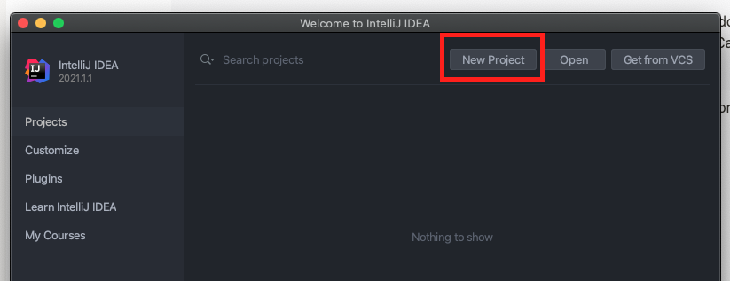

Select Java Enterprise and enter the information as shown below.

> Make sure you create the project in a directory you will remember. You will need to push it to GitHub.

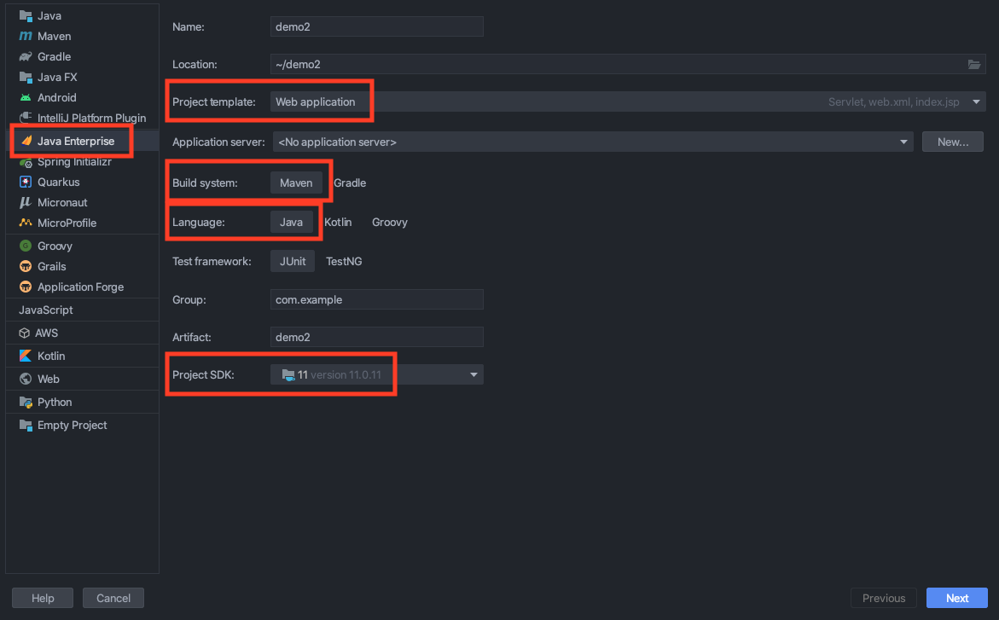

> IntelliJ comes bundled with Java Enterprise Edition. If it's not in this list, it means the installation was likely 
corrupted. Try uninstalling and re-installing IntelliJ.

In the same window, select New to create a new Application Server:

Select Tomcat Server:

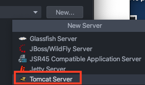

Select Browse:

Navigate to wherever you unzipped the Tomcat server you downloaded in step 2. Select the outermost folder then select 
Open:

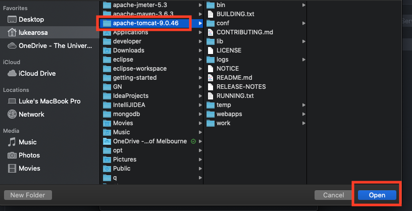

Select OK:

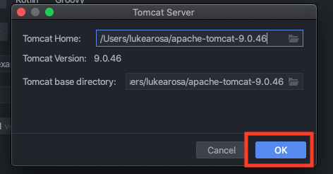

Select Next:

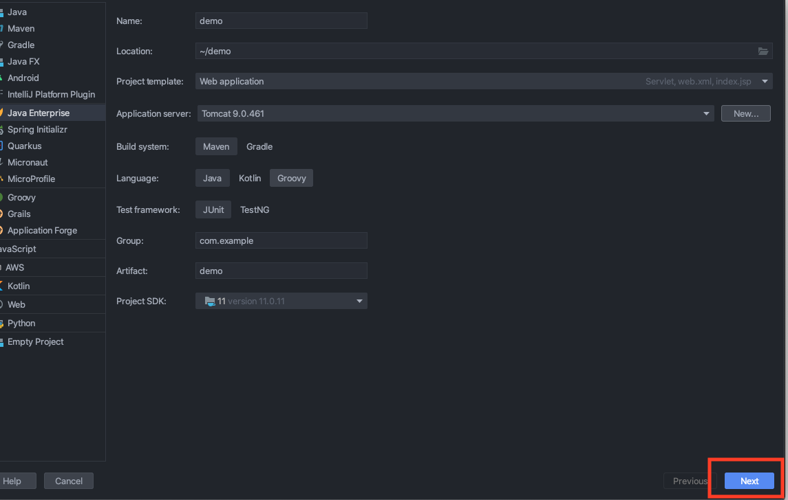

Make sure Servlet is selected then select Finish:

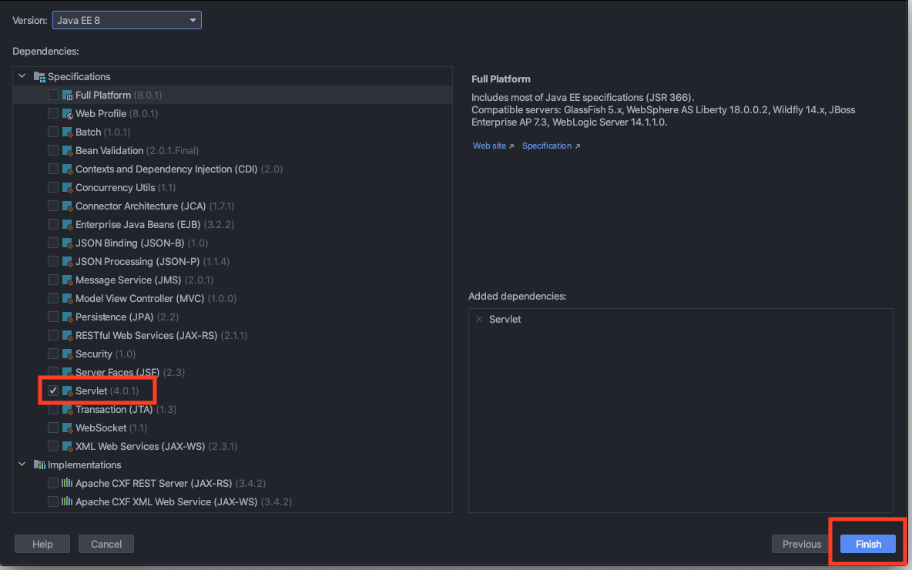

IntelliJ will create a HelloWorld Servlet project by default.

> Once IntelliJ has finished creating the project (this could take a minute or more), you should test Tomcat has 
been set up successfully.

In the upper-right corner, select Run on the Tomcat configuration:

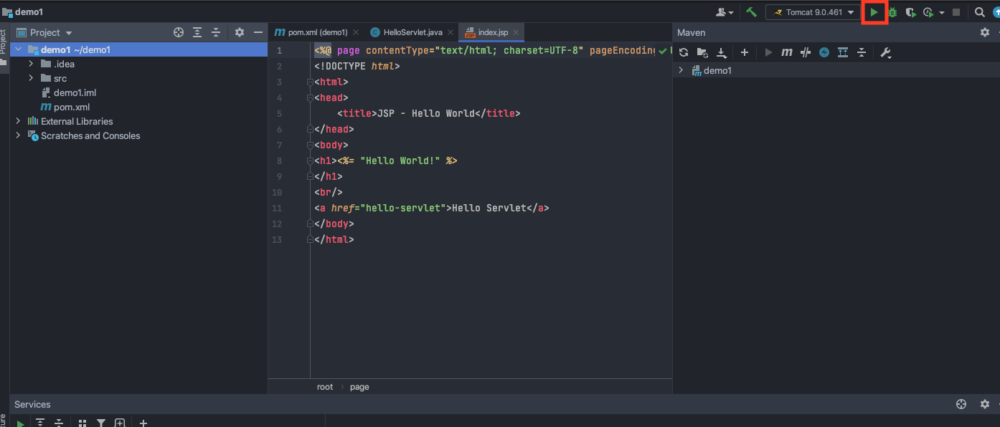

If you cannot select run configuration

Select Add Configuration:

Add a new TomCat local configuration:

Select Configure (Application Server may or may not already be populated - ignore it):

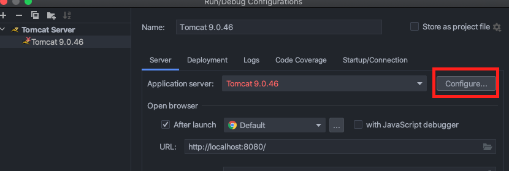

Select the Open icon:

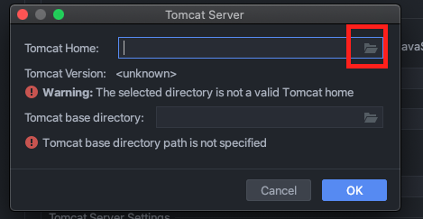

Select the folder where you unzipped the TomCat directory in [Step 2: Download Tomcat](2_tomcat_download.md):

Select OK:
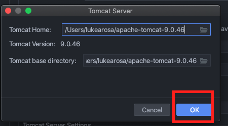

Select Deployment:

Select the Add icon:

Select Artifact:

Select demo:war exploded:

> *A Web application can be deployed to the TomCat server as an exploded directory where files and folders are presented
in the file system as separate items. A WAR file is a Web Archive file. An exploded WAR file means the structure is the
exact same as an archive file but not zipped into an archive form.*

Select Apply then OK:

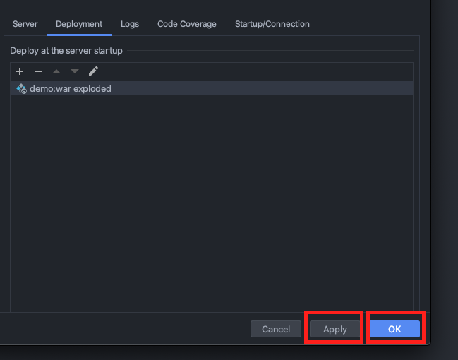

The project should be deployed to localhost:

To shut down the server, return to IntelliJ and select Stop:

---

> Please proceed to [Step 5: Setup GitHub Repository](5_github_setup.md).
